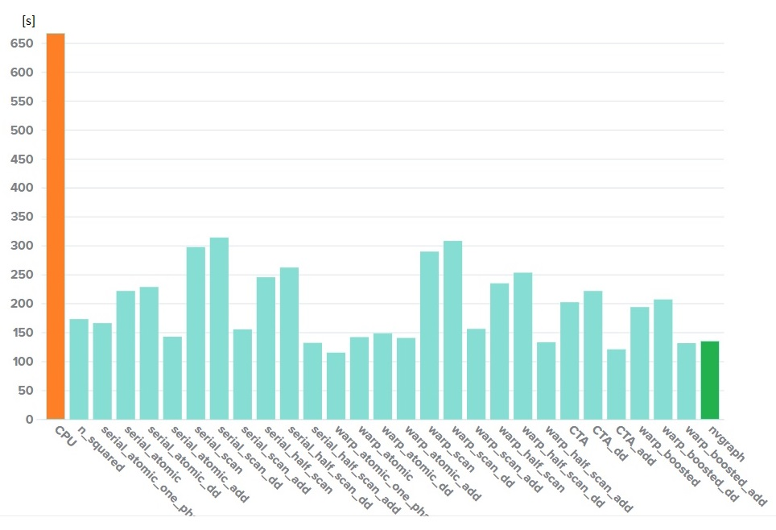

# multinode-bfs

My own take on implementing a couple of breadth-first search traversal algorithms using CUDA

## Background

I followed the example of Duane Merrill and Michael Garland's paper  
https://research.nvidia.com/publication/scalable-gpu-graph-traversal  
However, as this is a purely educational project, I wrote my own version of algorithms

## Contents

### Algorithms
* 2 naive solutions for comparison
* 3 gathering methods
* 4 methods of thread assingment
* 3 ways of avoiding duplicates during expansion
* 4 available block sizes: 128, 256, 512 and 1024
* 28 BFS algorithms available for testing overall

### Testing tools
* comparison with [nvgraph library](https://developer.nvidia.com/nvgraph)

## Example results
Summarized time of 100 traversals for a graph with 2 mln vertices and 16 mln edges

